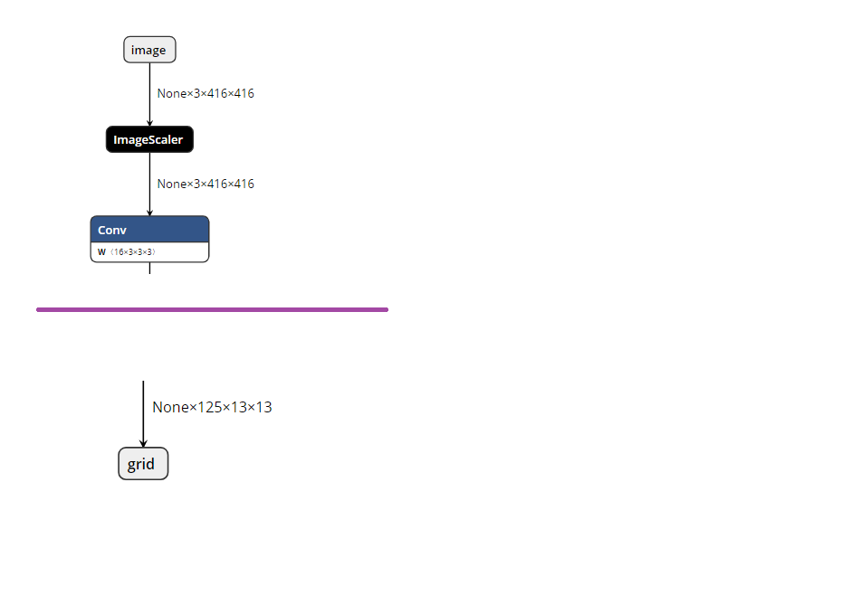

# Object Detection - Asp.Net Core Web & WPF Desktop Sample

| ML.NET version | API type    | Status     | App Type    | Data type   | Scenario         | ML Task       | Algorithms            |
|----------------|-------------|------------|-------------|-------------|------------------|---------------|-----------------------|
| v1.3.1         | Dynamic API | Up-to-date | End-End app | image files | Object Detection | Deep Learning | Tiny Yolo2 ONNX model |

## Problem

Object detection is one of the classical problems in computer vision: Recognize what objects are inside a given image and also where they are in the image. For these cases, you can either use pre-trained models or train your own model to classify images specific to your custom domain.

### How the app works

The WebApp shows the images listed on the right, and each image may be selected to process. Once the image is processed, it is drawn in the middle of the screen with labeled bounding boxes around each detected object as shown below.


Alternatively you can try uploading your own images as shown below.


## Pre-trained model

There are multiple pre-trained models for identifying multiple objects in the images. here we are using the pre-trained model, **Tiny Yolo2** in [**ONNX**](http://onnx.ai/) format. This model is a real-time neural network for object detection that detects 20 different classes. It is made up of 9 convolutional layers and 6 max-pooling layers and is a smaller version of the more complex full [YOLOv2](https://pjreddie.com/darknet/yolov2/) network.

The Open Neural Network eXchange i.e [ONNX](http://onnx.ai/) is an open format to represent deep learning models. With ONNX, developers can move models between state-of-the-art tools and choose the combination that is best for them. ONNX is developed and supported by a community of partners, including Microsoft.

The model is downloaded from the [ONNX Model Zoo](https://github.com/onnx/models/tree/master/tiny_yolov2) which is a is a collection of pre-trained, state-of-the-art models in the ONNX format.

The Tiny YOLO2 model was trained on the [Pascal VOC](http://host.robots.ox.ac.uk/pascal/VOC/) dataset. Below are the model's prerequisites.

### Model input and output

- **Input:** An image of the shape (3x416x416)  
- **Output:** An (1x125x13x13) array

### Pre-processing steps

Resize the input image to an (3x416x416) array of type float32.

### Post-processing steps

The output is a (125x13x13) tensor where 13x13 is the number of grid cells that the image gets divided into. Each grid cell corresponds to 125 channels, made up of the 5 bounding boxes predicted by the grid cell and the 25 data elements that describe each bounding box (5x25=125). For more information on how to derive the final bounding boxes and their corresponding confidence scores, refer to this [post](http://machinethink.net/blog/object-detection-with-yolo/).

## Solution

The sample contains Razor WebApp that contains both **Razor UI pages** and **API controller** classes to process images.

## Code Walkthrough

_This sample differs from the [getting-started object detection sample](https://github.com/dotnet/machinelearning-samples/tree/master/samples/csharp/getting-started/DeepLearning_ObjectDetection_Onnx) in that here we load/process the images **in-memory** whereas the getting-started sample loads the images from a **file**._

Create a class that defines the data schema to use while loading data into an IDataView. ML.NET supports the `Bitmap` type for images, so we'll specify `Bitmap` property decorated with the `ImageTypeAttribute`, as shown below.

```csharp
public class ImageInputData
{
    [ImageType(416, 416)]
    public Bitmap Image { get; set; }
}
```

### ML.NET: Configure the model

The first step is to create an empty DataView as we just need schema of data while configuring up model.

```csharp
var dataView = _mlContext.Data.LoadFromEnumerable(new List<ImageInputData>());
```

The second step is to define the estimator pipeline. Usually when dealing with deep neural networks, you must adapt the images to the format expected by the network. For this reason, the code below resizes and transforms the images (pixel values are normalized across all R,G,B channels).

```csharp
var pipeline = _mlContext.Transforms.ResizeImages(resizing: ImageResizingEstimator.ResizingKind.Fill, outputColumnName: "image", imageWidth: ImageSettings.imageWidth, imageHeight: ImageSettings.imageHeight, inputColumnName: nameof(ImageInputData.Image))
                            .Append(_mlContext.Transforms.ExtractPixels(outputColumnName: "image"))
                            .Append(_mlContext.Transforms.ApplyOnnxModel(modelFile: onnxModelFilePath, outputColumnNames: new[] { TinyYoloModelSettings.ModelOutput }, inputColumnNames: new[] { TinyYoloModelSettings.ModelInput }));
```

You also need to inspect the neural network to get the names of the input and output nodes. To do this, you can use tools like [Netron](https://github.com/lutzroeder/netron), which is automatically installed with [Visual Studio Tools for AI](https://visualstudio.microsoft.com/downloads/ai-tools-vs/).
These names are used later when we define the estimation pipeline: in the case of the Tiny Yolo2 network, the input tensor is named **'image'** and the output is named **'grid'**.

Define the **input** and **output** parameters of the Tiny Yolo2 Onnx Model.

```csharp
public struct TinyYoloModelSettings
{
    // for checking TIny yolo2 Model input and  output  parameter names,
    // you can use tools like Netron, which is installed by Visual Studio AI Tools

    // input tensor name
    public const string ModelInput = "image";

    // output tensor name
    public const string ModelOutput = "grid";
}
```



Create the model by fitting the DataView.

```csharp
var model = pipeline.Fit(dataView);
```

## Detect objects in the image

After the model is configured, we need to save the model, load the saved model and the pass the image to the model to detect objects.
When obtaining the prediction, we get an `float` array of size **21125** in the `PredictedLabels` property. This is the 125x13x13 output of the model discussed earlier. We then use the `YoloOutputParser` class to interpret and returns a number of bounding boxes for each image. Again these boxes are filtered so that we retrieve only 5 with high confidence.

```csharp
 var probs = model.Predict(imageInputData).PredictedLabels;
 IList<YoloBoundingBox> boundingBoxes = _parser.ParseOutputs(probs);
 filteredBoxes = _parser.FilterBoundingBoxes(boundingBoxes, 5, .5F);
```

## Draw bounding boxes around detected objects in Image

The final step is to draw the bounding boxes around the objects using Paint API and return and display the image in the browser.

```csharp
var img = _objectDetectionService.DrawBoundingBox(imageFilePath);

using (MemoryStream m = new MemoryStream())
{
   img.Save(m, img.RawFormat);
   byte[] imageBytes = m.ToArray();

   // Convert byte[] to Base64 String
   base64String = Convert.ToBase64String(imageBytes);
   var result = new Result { imageString = base64String };
   return result;
}
```

**Note** Tiny YOLO2 is significantly less accurate than the full YOLO2 model, but the tiny version is sufficient for this sample app.
